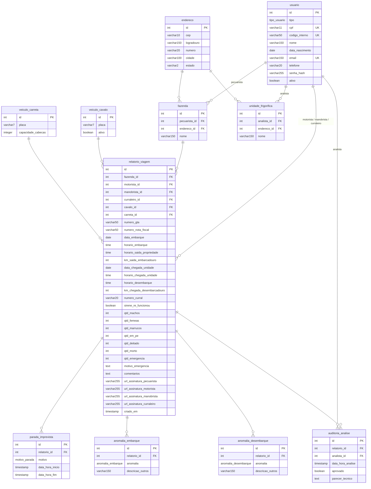

# Diagrama e Especificação do Banco de Dados - Efficientia

Este documento contém o Esquema Relacional do Banco de Dados do sistema **Efficientia**, capturado da modelagem oficial no `dbdiagram.io`.

---

## Visualização do Modelo ER (Mermaid)

---

## Enumeradores (Enums)

### `tipo_usuario`
- `motorista`
- `manobrista`
- `analista`
- `pecuarista`
- `curraleiro`

### `motivo_parada`
- `transbordo`
- `acidente_pista`
- `atoleiro`
- `problema_mecanico`
- `outro`

### `anomalia_embarque`
- `sangrando`
- `excesso_magreza_debilitado`
- `cutucoes_fortes`
- `mancando`
- `sujo_pisoteio`
- `tentativa_quebrar_cauda`
- `gaiola_cheia`
- `chute_paulada_ferrao`
- `arraste`
- `outro`

### `anomalia_desembarque`
- `gaiola_buraco_estrado_solto`
- `porteiras_nao_abrem`
- `uso_abusivo_choque`
- `problema_mecanico_veiculo`
- `outros_atos_abuso`

---

## Tabela `usuario` (Detalhes para Autenticação / Cadastro)

| Coluna | Tipo | Restrições | Descrição |
| --- | --- | --- | --- |
| `id` | `INT` | PK, AUTO_INCREMENT | Identificador único do usuário |
| `tipo` | `tipo_usuario` | NOT NULL | Tipo/Papel do usuário |
| `cpf` | `VARCHAR(11)` | NOT NULL, UNIQUE | CPF sem pontuação (11 dígitos) |
| `codigo_interno` | `VARCHAR(50)` | UNIQUE | Código interno / Código da empresa |
| `nome` | `VARCHAR(150)` | NOT NULL | Nome completo |
| `data_nascimento` | `DATE` | | Data de nascimento |
| `email` | `VARCHAR(150)` | UNIQUE | E-mail de login / contato |
| `telefone` | `VARCHAR(20)` | | Telefone de contato |
| `senha_hash` | `VARCHAR(255)` | NOT NULL | Senha criptografada (BCrypt) |
| `ativo` | `BOOLEAN` | NOT NULL | Status do usuário (true/false) |
