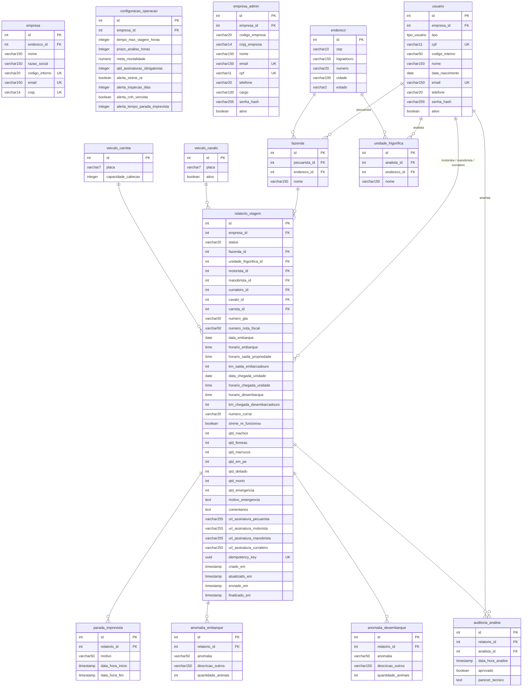

# Diagrama e Especificação do Banco de Dados - Efficientia

Este documento contém o Esquema Relacional do Banco de Dados do sistema **Efficientia**, capturado da modelagem oficial no `dbdiagram.io`.

---

## Visualização do Modelo ER (Mermaid)

```mermaid
erDiagram
    empresa {
        int id PK
        int endereco_id FK
        varchar150 nome
        varchar150 razao_social
        varchar20 codigo_interno UK
        varchar150 email UK
        varchar14 cnpj UK
    }

    configuracao_operacao {
        int id PK
        int empresa_id FK
        integer tempo_max_viagem_horas
        integer prazo_analise_horas
        numeric meta_mortalidade
        integer qtd_assinaturas_obrigatorias
        boolean alerta_sirene_re
        integer alerta_inspecao_dias
        boolean alerta_cnh_vencida
        integer alerta_tempo_parada_imprevista
    }

    empresa_admin {
        int id PK
        int empresa_id FK
        varchar20 codigo_empresa
        varchar14 cnpj_empresa
        varchar150 nome
        varchar150 email UK
        varchar11 cpf UK
        varchar20 telefone
        varchar100 cargo
        varchar255 senha_hash
        boolean ativo
    }

    usuario {
        int id PK
        int empresa_id FK
        tipo_usuario tipo
        varchar11 cpf UK
        varchar50 codigo_interno
        varchar150 nome
        date data_nascimento
        varchar150 email UK
        varchar20 telefone
        varchar255 senha_hash
        boolean ativo
    }
    veiculo_cavalo {
        int id PK
        varchar7 placa
        boolean ativo
    }

    veiculo_carreta {
        int id PK
        varchar7 placa
        integer capacidade_cabecas
    }

    endereco {
        int id PK
        varchar10 cep
        varchar150 logradouro
        varchar20 numero
        varchar100 cidade
        varchar2 estado
    }

    fazenda {
        int id PK
        int pecuarista_id FK
        int endereco_id FK
        varchar150 nome
    }

    unidade_frigorifica {
        int id PK
        int analista_id FK
        int endereco_id FK
        varchar150 nome
    }

    relatorio_viagem {
        int id PK
        int empresa_id FK
        varchar20 status
        int fazenda_id FK
        int unidade_frigorifica_id FK
        int motorista_id FK
        int manobrista_id FK
        int curraleiro_id FK
        int cavalo_id FK
        int carreta_id FK
        varchar50 numero_gta
        varchar50 numero_nota_fiscal
        date data_embarque
        time horario_embarque
        time horario_saida_propriedade
        int km_saida_embarcadouro
        date data_chegada_unidade
        time horario_chegada_unidade
        time horario_desembarque
        int km_chegada_desembarcadouro
        varchar20 numero_curral
        boolean sirene_re_funcionou
        int qtd_machos
        int qtd_femeas
        int qtd_marrucos
        int qtd_em_pe
        int qtd_deitado
        int qtd_morto
        int qtd_emergencia
        text motivo_emergencia
        text comentarios
        varchar255 url_assinatura_pecuarista
        varchar255 url_assinatura_motorista
        varchar255 url_assinatura_manobrista
        varchar255 url_assinatura_curraleiro
        uuid idempotency_key UK
        timestamp criado_em
        timestamp atualizado_em
        timestamp enviado_em
        timestamp finalizado_em
    }

    parada_imprevista {
        int id PK
        int relatorio_id FK
        varchar50 motivo
        timestamp data_hora_inicio
        timestamp data_hora_fim
    }

    anomalia_embarque {
        int id PK
        int relatorio_id FK
        varchar50 anomalia
        varchar150 descricao_outros
        int quantidade_animais
    }

    anomalia_desembarque {
        int id PK
        int relatorio_id FK
        varchar50 anomalia
        varchar150 descricao_outros
        int quantidade_animais
    }

    auditoria_analise {
        int id PK
        int relatorio_id FK
        int analista_id FK
        timestamp data_hora_analise
        boolean aprovado
        text parecer_tecnico
    }

    usuario ||--o{ fazenda : "pecuarista"
    usuario ||--o{ unidade_frigorifica : "analista"
    usuario ||--o{ relatorio_viagem : "motorista / manobrista / curraleiro"
    endereco ||--o{ fazenda : ""
    endereco ||--o{ unidade_frigorifica : ""
    fazenda ||--o{ relatorio_viagem : ""
    veiculo_cavalo ||--o{ relatorio_viagem : ""
    veiculo_carreta ||--o{ relatorio_viagem : ""
    relatorio_viagem ||--o{ parada_imprevista : ""
    relatorio_viagem ||--o{ anomalia_embarque : ""
    relatorio_viagem ||--o{ anomalia_desembarque : ""
    relatorio_viagem ||--o{ auditoria_analise : ""
    usuario ||--o{ auditoria_analise : "analista"
```

### Diário de rota (integração mobile)

O relatório mantém o ciclo `rascunho` → `pendente` → `aprovado`/`reprovado`. A API persiste `unidade_frigorifica_id`, status, horários de auditoria e chave de idempotência junto ao relatório. A duração em minutos e a distância em quilômetros são calculadas pelo servidor a partir dos horários e odômetros válidos.

Paradas imprevistas persistem motivo e início/fim. Anomalias de embarque e desembarque guardam código, descrição livre e quantidade de animais envolvidos. A referência da assinatura fixa do motorista é copiada ao relatório no momento da criação e permanece como fotografia daquele lançamento.

---

## Enums e códigos controlados

`tipo_usuario` permanece um enum PostgreSQL. A migration V10 converte os campos de motivo e anomalia para `VARCHAR(50)` com constraints `CHECK`, alinhando o banco aos atributos `String` do JPA; os tipos enum antigos continuam declarados pela V1, mas não são mais usados por essas colunas.

### `tipo_usuario`
- `motorista`
- `manobrista`
- `analista`
- `pecuarista`
- `curraleiro`

### `motivo_parada`
- `transbordo`
- `acidente_pista`
- `atoleiro`
- `problema_mecanico`
- `outro`

### `anomalia_embarque`
- `sangrando`
- `excesso_magreza_debilitado`
- `cutucoes_fortes`
- `mancando`
- `sujo_pisoteio`
- `tentativa_quebrar_cauda`
- `gaiola_cheia`
- `chute_paulada_ferrao`
- `arraste`
- `outro`

### `anomalia_desembarque`
- `gaiola_buraco_estrado_solto`
- `porteiras_nao_abrem`
- `uso_abusivo_choque`
- `problema_mecanico_veiculo`
- `outros_atos_abuso`

---

## Tabela `usuario` (Detalhes para Autenticação / Cadastro)

| Coluna | Tipo | Restrições | Descrição |
| --- | --- | --- | --- |
| `id` | `INT` | PK, AUTO_INCREMENT | Identificador único do usuário |
| `tipo` | `tipo_usuario` | NOT NULL | Tipo/Papel do usuário |
| `cpf` | `VARCHAR(11)` | NOT NULL, UNIQUE | CPF sem pontuação (11 dígitos) |
| `codigo_interno` | `VARCHAR(50)` | UNIQUE | Código interno / Código da empresa |
| `nome` | `VARCHAR(150)` | NOT NULL | Nome completo |
| `data_nascimento` | `DATE` | | Data de nascimento |
| `email` | `VARCHAR(150)` | UNIQUE | E-mail de login / contato |
| `telefone` | `VARCHAR(20)` | | Telefone de contato |
| `senha_hash` | `VARCHAR(255)` | NOT NULL | Senha criptografada (BCrypt) |
| `ativo` | `BOOLEAN` | NOT NULL | Status do usuário (true/false) |
