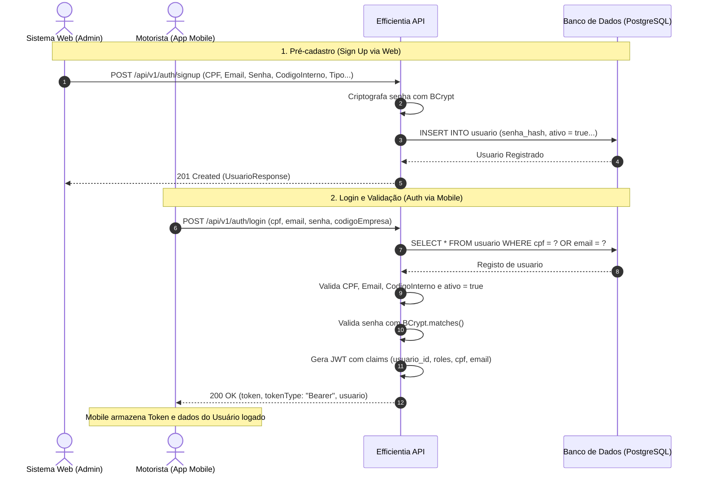

# SPEC-SPRINT-16 — Fluxo de Autenticação e Cadastro (Mobile & Web)

## 1. Contexto e Objetivo

Esta especificação define o fluxo integrado de autenticação e cadastro de usuários entre o sistema **Web** (responsável pelo pré-cadastro de motoristas e funcionários) e o aplicativo **Mobile** ([Efficientia-mobile](https://github.com/Efficientia/Efficientia-mobile.git)).

No aplicativo mobile, a tela de login (`LoginMotoristaActivity`) exige a validação de 4 campos:
1. `CPF` (11 dígitos numéricos)
2. `E-mail`
3. `Senha`
4. `Código da Empresa` (`codigoEmpresa`)

A API valida se estes dados já foram pré-cadastrados no banco de dados através do sistema Web. Se as credenciais forem válidas e o usuário estiver ativo, a API emite um token JWT Bearer e retorna os dados do usuário para que o aplicativo mobile possa armazenar as informações da sessão localmente.

---

## 2. Diagrama de Sequência do Fluxo



---

## 3. Especificação dos Contratos REST

### 3.1. Sign Up (Pré-cadastro via Web)
- **Endpoint**: `POST /api/v1/auth/signup` (ou `POST /api/v1/usuarios`)
- **Autenticação**: Pública (ou via Token Admin)
- **Status de Sucesso**: `201 Created`

#### Request Body
```json
{
  "tipo": "motorista",
  "cpf": "12345678901",
  "codigoInterno": "EMP-100",
  "nome": "João Silva",
  "dataNascimento": "1990-05-15",
  "email": "joao.silva@empresa.com",
  "telefone": "11987654321",
  "senha": "SenhaSegura123"
}
```

#### Response Body (`201 Created`)
```json
{
  "id": 1,
  "tipo": "motorista",
  "cpf": "12345678901",
  "codigoInterno": "EMP-100",
  "nome": "João Silva",
  "dataNascimento": "1990-05-15",
  "email": "joao.silva@empresa.com",
  "telefone": "11987654321",
  "ativo": true
}
```

---

### 3.2. Login / Autenticação (Mobile)
- **Endpoint**: `POST /api/v1/auth/login`
- **Autenticação**: Pública (`permitAll`)
- **Status de Sucesso**: `200 OK`

#### Request Body
```json
{
  "cpf": "12345678901",
  "email": "joao.silva@empresa.com",
  "senha": "SenhaSegura123",
  "codigoEmpresa": "EMP-100"
}
```

#### Response Body (`200 OK`)
```json
{
  "token": "eyJhbGciOiJIUzI1NiIsInR5cCI6IkpXVCJ9...",
  "tokenType": "Bearer",
  "usuario": {
    "id": 1,
    "tipo": "motorista",
    "cpf": "12345678901",
    "codigoInterno": "EMP-100",
    "nome": "João Silva",
    "dataNascimento": "1990-05-15",
    "email": "joao.silva@empresa.com",
    "telefone": "11987654321",
    "ativo": true
  }
}
```

---

## 4. Regras de Validação e Erros

| Erro | Status HTTP | Causa | Resposta (RFC 7807) |
| --- | --- | --- | --- |
| Usuário não encontrado | `401 Unauthorized` | CPF ou E-mail não existem no BD | `"Credenciais inválidas: usuário não encontrado."` |
| Divergência de CPF/E-mail | `401 Unauthorized` | O CPF informado não pertence ao E-mail enviado | `"Credenciais inválidas: CPF diverge do cadastrado."` |
| Código de Empresa Incorreto | `401 Unauthorized` | `codigoEmpresa` diverge de `codigo_interno` | `"Código da empresa incorreto."` |
| Senha Incorreta | `401 Unauthorized` | Hash BCrypt não confere com a senha digitada | `"Credenciais inválidas: senha incorreta."` |
| Usuário Inativo | `401 Unauthorized` | `ativo == false` no banco de dados | `"Usuário inativo no sistema."` |
| Dados Inválidos | `400 Bad Request` | Formato inválido de CPF ou e-mail na requisição | `"Dados inválidos"` + lista de erros por campo |
| Cadastro Duplicado (Signup) | `409 Conflict` | CPF ou E-mail já cadastrado | `"Já existe um usuário com o CPF/e-mail informado."` |

---

## 5. Mapeamento de Campos com o Banco de Dados

Referência da tabela `usuario` no modelo relacional (`docs/DATABASE_DIAGRAM.md`):

| Campo Mobile (`LoginMotoristaActivity`) | Campo API Request (`LoginRequest`) | Coluna no Banco (`usuario`) | Criptografia / Regra |
| --- | --- | --- | --- |
| `edtCpf` | `cpf` | `cpf` (`VARCHAR(11)`) | Limpo de pontuações (apenas dígitos) |
| `edtEmail` | `email` | `email` (`VARCHAR(150)`) | Normalizado em caixa baixa (lowercase) |
| `edtSenha` | `senha` | `senha_hash` (`VARCHAR(255)`) | Validação com `BCryptPasswordEncoder.matches()` |
| `edtCodigoEmpresa` | `codigoEmpresa` | `codigo_interno` (`VARCHAR(50)`) | Comparação case-insensitive |

---

## 6. Instruções de Integração no App Mobile

Ao receber a resposta `200 OK` da API no login:
1. Armazenar o `token` JWT em SharedPreferences / EncryptedSharedPreferences (ex: `Bearer <token>`) para utilizar no cabeçalho `Authorization: Bearer <token>` em requisições subsequentes.
2. Salvar os dados do objeto `usuario` (ex: `id`, `nome`, `cpf`, `email`, `codigoInterno`) no contexto local do aplicativo para personalizar a tela do motorista e associar as relatórios de viagem criados offline/online.
