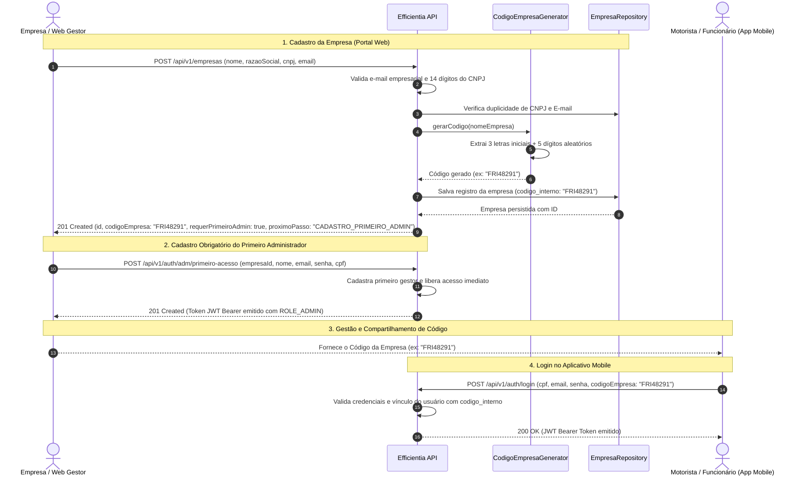

# SPEC-SPRINT-17 — Cadastro de Empresas, Geração de Código de Acesso e Esteira Obrigatória de Onboarding

## 1. Contexto e Objetivo

Esta especificação formaliza a implementação do módulo de **Cadastro de Empresas** no ecossistema Efficientia, em total conformidade com a modelagem relacional de banco de dados (script oficial e diagrama PDF de tabelas) e com os requisitos do Frontend corporativo.

O objetivo principal é disponibilizar para a aplicação Web (Portal/Dashboard Corporativo) a capacidade de registrar novas empresas parceiras, gerar de forma automatizada o **código corporativo de 8 dígitos** (`codigo_interno` / `codigoEmpresa`) e estabelecer a esteira obrigatória de acesso para desbloqueio corporativo e integração com o aplicativo mobile ([Efficientia-mobile](https://github.com/Efficientia/Efficientia-mobile.git)).

Os requisitos fundamentais contemplados são:
1. **Dados de Entrada Corporativos**: Recebimento de `nomeEmpresa` (nome fantasia), `razaoSocial`, `cnpj` (14 dígitos numéricos) e `emailCorporativo` (e-mail empresarial), além de senha corporativa opcional e endereço associado (`endereco_id`).
2. **Geração Automatizada de Código**: Algoritmo no backend que extrai as 3 primeiras letras do nome da empresa e anexa 5 números gerados aleatoriamente (ex: `FRI48291`), garantindo tamanho fixo de 8 caracteres, padrão `^[A-Z]{3}[0-9]{5}$` e unicidade persistida na coluna `codigo_interno`.
3. **Obrigatoriedade do Primeiro Administrador**: Logo após a tela de registro de empresa, **é de total obrigatoriedade** o cadastro de um primeiro administrador. Sem esse administrador cadastrado, a empresa permanece com status `PENDENTE_PRIMEIRO_ADMIN`, sem acesso liberado, até que o gestor conclua o onboarding do administrador.
4. **Segurança e Criptografia**: Criptografia de senhas via `BCryptPasswordEncoder` e regras públicas de onboarding configuradas em `SecurityConfig.java`.
5. **Alinhamento Relacional (Flyway V5)**: Persistência compatível com a tabela `empresa` definida no script oficial (`id`, `endereco_id`, `nome`, `razao_social`, `codigo_interno`, `email`, `cnpj`).

---

## 2. Diagrama de Sequência do Fluxo Integrado



---

## 3. Especificação dos Contratos REST

### 3.1. Cadastro de Empresa (Web)
- **Endpoint Primário**: `POST /api/v1/empresas`
- **Alias Suportado**: `POST /api/v1/auth/empresas`
- **Autenticação**: Pública (`permitAll()`)
- **Status de Sucesso**: `201 Created`

#### Request Body
```json
{
  "nomeEmpresa": "Friboi Alimentos",
  "razaoSocial": "JBS S.A.",
  "cnpj": "12.345.678/0001-95",
  "emailCorporativo": "contato@friboi.com.br",
  "senha": "senhaSeguraOpcional123",
  "enderecoId": 1
}
```

> **Flexibilidade de Integração (Aliases):** O DTO aceita tanto as chaves principais quanto aliases através de anotações Jackson:
> - `nomeEmpresa` ou `nome`, `nome_empresa`.
> - `razaoSocial` ou `razao_social`.
> - `emailCorporativo` ou `email`, `email_corporativo`, `email_empresarial`.
> - `cnpj` ou `cnpj_empresa` (com ou sem máscara de pontuação).
> - `senha` ou `password`.
> - `enderecoId` ou `endereco_id`, `idEndereco`.

#### Response Body (`201 Created`)
```json
{
  "id": 1,
  "codigoEmpresa": "FRI48291",
  "codigo": "FRI48291",
  "codigoInterno": "FRI48291",
  "nomeEmpresa": "Friboi Alimentos",
  "nome": "Friboi Alimentos",
  "razaoSocial": "JBS S.A.",
  "cnpj": "12345678000195",
  "emailCorporativo": "contato@friboi.com.br",
  "email": "contato@friboi.com.br",
  "enderecoId": 1,
  "status": "PENDENTE_PRIMEIRO_ADMIN",
  "requerPrimeiroAdmin": true,
  "proximoPasso": "CADASTRO_PRIMEIRO_ADMIN",
  "mensagem": "Empresa registrada com sucesso. O cadastro do primeiro administrador é obrigatório para liberar o acesso ao sistema.",
  "criadoEm": "2026-09-24T14:30:00Z"
}
```

---

### 3.2. Consulta de Empresa por Código de Acesso
- **Endpoint**: `GET /api/v1/empresas/codigo/{codigo}`
- **Autenticação**: Pública (`permitAll()`)
- **Objetivo**: Permite ao aplicativo mobile ou portal Web validar a existência do código da empresa e exibir o nome fantasia corporativo.
- **Status de Sucesso**: `200 OK`

#### Response Body (`200 OK`)
```json
{
  "id": 1,
  "codigoEmpresa": "FRI48291",
  "codigo": "FRI48291",
  "codigoInterno": "FRI48291",
  "nomeEmpresa": "Friboi Alimentos",
  "razaoSocial": "JBS S.A.",
  "cnpj": "12345678000195",
  "emailCorporativo": "contato@friboi.com.br",
  "status": "ATIVO",
  "requerPrimeiroAdmin": false,
  "criadoEm": "2026-09-24T14:30:00Z"
}
```

---

### 3.3. Consulta de Empresa por CNPJ
- **Endpoint**: `GET /api/v1/empresas/cnpj/{cnpj}`
- **Autenticação**: Pública (`permitAll()`)
- **Objetivo**: Permite validar se o CNPJ já está cadastrado ou recuperar os metadados corporativos.
- **Status de Sucesso**: `200 OK`

---

## 4. Regras de Negócio e Algoritmos

### 4.1. Algoritmo de Geração do Código (`CodigoEmpresaGenerator`)
Cada empresa recebe um código alfanumérico com exatamente **8 caracteres**, seguindo a expressão regular `^[A-Z]{3}[0-9]{5}$`:

1. **Normalização do Nome**:
   - Aplica-se `Normalizer.normalize(nome, Normalizer.Form.NFD)` para eliminação de acentuações (`Ç` $\rightarrow$ `C`, `Ã` $\rightarrow$ `A`, `É` $\rightarrow$ `E`).
   - Remove-se caracteres não alfabéticos (`[^A-Za-z]`) e converte-se para caixa alta (`toUpperCase`).
2. **Extração das 3 Primeiras Letras**:
   - Se o resultado obtido possuir 3 ou mais letras, seleciona-se `substring(0, 3)` (ex: "Friboi" $\rightarrow$ "FRI", "Agropecuária" $\rightarrow$ "AGR").
   - Se possuir menos de 3 letras (ex: "Oi", "3M"), o prefixo é completado até atingir 3 letras usando caracteres aleatórios de `A-Z`.
3. **Geração do Sufixo Numérico**:
   - Sorteio de número inteiro entre `0` e `99999` com formatação fixa de 5 dígitos (`String.format("%05d", numero)`).
4. **Resolução de Colisão**:
   - Em caso de colisão de código no repositório, o serviço efetua até 20 tentativas de regeneração antes de persistir.

### 4.2. Higienização e Validação do CNPJ
- O valor recebido no campo `cnpj` tem pontuações e símbolos removidos (`replaceAll("[^0-9]", "")`).
- Valida-se estritamente o comprimento resultante de 14 dígitos numéricos. Valores divergentes resultam em `400 Bad Request`.

### 4.3. Tratamento de Erros e Respostas RFC 7807

| Cenário de Erro | Status HTTP | Tipo de Exceção | Resposta (RFC 7807) |
| --- | --- | --- | --- |
| Dados Incompletos / Nulos | `400 Bad Request` | `MethodArgumentNotValidException` | `"title": "Dados inválidos"` com mapa de campos em `erros`. |
| CNPJ com formato inválido | `400 Bad Request` | `CadastroInvalidoException` | `"title": "Cadastro inválido", "detail": "CNPJ inválido. Deve conter 14 dígitos numéricos."` |
| CNPJ Duplicado | `409 Conflict` | `CadastroDuplicadoException` | `"title": "Cadastro duplicado", "detail": "Já existe uma empresa cadastrada com o CNPJ informado."` |
| E-mail Corporativo Duplicado | `409 Conflict` | `CadastroDuplicadoException` | `"title": "Cadastro duplicado", "detail": "Já existe uma empresa cadastrada com o e-mail corporativo informado."` |
| Empresa não Encontrada | `404 Not Found` | `ResponseStatusException` | `"title": "Not Found", "detail": "Empresa não encontrada para o identificador informado."` |

---

## 5. Estrutura de Banco de Dados (Flyway Migration V5)

A migração `src/main/resources/db/migration/V5__create_empresa_and_configuracao.sql` implementa rigorosamente a tabela `empresa` e os satélites de configuração operacional e governança definidos no script e diagrama PDF:

```sql
CREATE TABLE IF NOT EXISTS public.empresa (
    id SERIAL PRIMARY KEY,
    endereco_id INTEGER REFERENCES public.endereco(id) ON DELETE SET NULL,
    nome VARCHAR(150),
    razao_social VARCHAR(150),
    codigo_interno VARCHAR(20) NOT NULL UNIQUE,
    email VARCHAR(150) UNIQUE,
    cnpj VARCHAR(14) UNIQUE NOT NULL,
    senha_hash VARCHAR(255),
    ativo BOOLEAN NOT NULL DEFAULT TRUE,
    criado_em TIMESTAMPTZ NOT NULL DEFAULT CURRENT_TIMESTAMP,
    atualizado_em TIMESTAMPTZ NOT NULL DEFAULT CURRENT_TIMESTAMP
);

CREATE INDEX IF NOT EXISTS idx_empresa_codigo ON public.empresa(codigo_interno);
CREATE INDEX IF NOT EXISTS idx_empresa_cnpj ON public.empresa(cnpj);
CREATE INDEX IF NOT EXISTS idx_empresa_email ON public.empresa(email);
```
