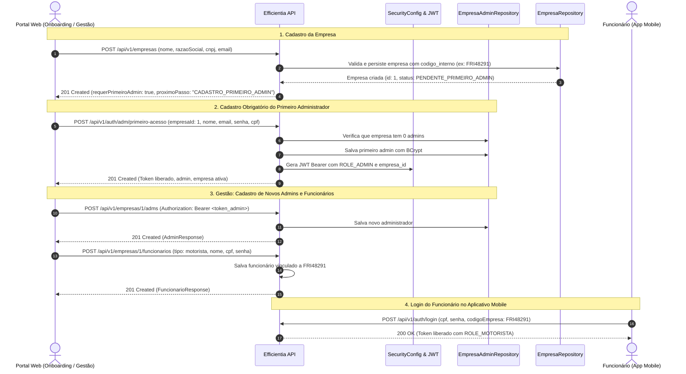

# SPEC-SPRINT-18 — Login de Empresas, Login de Administradores por Empresa e Gestão de Funcionários

## 1. Contexto e Atualização de Fluxo

Em alinhamento entre a equipe de produto, engenharia e a modelagem oficial de dados (script SQL e diagrama de tabelas PDF), o ecossistema corporativo do Efficientia estabelece o isolamento multi-tenant, a esteira de onboarding corporativo e a autenticação granular de empresas parceiras:

1. **Separação de Entidades e Dois Modelos de Login**:
   - **Login de Empresa (`POST /api/v1/auth/empresa/login`)**:
     Identifica a empresa parceira através do seu **CNPJ** (faturado e chave jurídica), e-mail empresarial ou código de acesso de 8 dígitos (`codigo_interno`). Permite validar o status operacional da empresa e verificar se a esteira de onboarding foi completada. Caso a empresa não possua nenhum administrador cadastrado, a API retorna `status: "PENDENTE_PRIMEIRO_ADMIN"` e `requerPrimeiroAdmin: true`, orientando o frontend a abrir obrigatoriamente a tela de cadastro do primeiro administrador. Se credenciais forem fornecidas, autentica o gestor corporativo.
   - **Login de Administrador por Empresa (`POST /api/v1/auth/adm/login`)**:
     Autentica o gestor (pessoa física com perfil de administração) através de e-mail corporativo ou CPF (11 dígitos numéricos) e senha, validando opcionalmente o escopo da empresa (`codigoEmpresa` ou `cnpj`). Retorna o token JWT Bearer com autoridades `ROLE_ADMIN` e `ROLE_ADMINISTRADOR`.

2. **Esteira de Cadastro e Obrigatoriedade do Primeiro Administrador**:
   - **Passo 1 (Registro da Empresa)**: O responsável insere os dados da empresa (`nome`, `razaoSocial`, `cnpj`, `emailCorporativo`, `enderecoId`). A API valida, persiste e gera o código de acesso de 8 dígitos alfanumérico (`codigo_interno`).
   - **Passo 2 (Cadastro Obrigatório do Primeiro Administrador)**: Imediatamente após a tela de registro de empresa, **é de total obrigatoriedade** o cadastro de um administrador. A empresa não possui acesso ao painel enquanto o primeiro gestor não for registrado (`POST /api/v1/auth/adm/primeiro-acesso`). Uma vez cadastrado, o primeiro admin recebe o token JWT com acesso liberado.

3. **Autonomia do Administrador (Cadastrar Outros Admins e Funcionários)**:
   - Uma vez autenticado, o administrador da empresa tem autoridade para:
     a) **Cadastrar outros administradores** (`POST /api/v1/empresas/{empresaId}/adms`): permite divisão de responsabilidades entre RH, diretoria e operações.
     b) **Cadastrar funcionários operacionais** (`POST /api/v1/empresas/{empresaId}/funcionarios`): cadastra motoristas, manobristas, analistas, curraleiros e pecuaristas, vinculando-os automaticamente ao código da empresa para que possam realizar o login no app mobile ([Efficientia-mobile](https://github.com/Efficientia/Efficientia-mobile.git)).
     c) **Listar administradores e funcionários da empresa** (`GET /api/v1/empresas/{empresaId}/adms` e `GET /api/v1/empresas/{empresaId}/funcionarios`).

4. **Alinhamento com o Script e Diagrama de Tabelas PDF**:
   - Enum `tipo_usuario`: contempla `'administrador'`, `'motorista'`, `'manobrista'`, `'analista'`, `'pecuarista'`, `'curraleiro'`.
   - Tabela `empresa`: master do tenant SaaS (`id`, `endereco_id`, `nome`, `razao_social`, `codigo_interno`, `email`, `cnpj`).
   - Tabela `configuracao_operacao`: parametrização de alertas e SLAs operacionais (1:1 com empresa).
   - Tabela `empresa_admin`: governança de múltiplos gestores por transportadora.

---

## 2. Diagrama de Sequência do Fluxo Integrado



---

## 3. Especificação dos Contratos REST

### 3.1. Login / Verificação da Empresa
- **Endpoint**: `POST /api/v1/auth/empresa/login` (aliases: `/api/v1/auth/empresas/login`, `/api/v1/empresas/login`)
- **Autenticação**: Pública (`permitAll()`)
- **Status**: `200 OK`

#### Request Body
```json
{
  "cnpj": "12.345.678/0001-95",
  "senha": "senhaOpcional123"
}
```

#### Response Body — Empresa sem Administrador (`200 OK`)
```json
{
  "empresa": {
    "id": 1,
    "codigoEmpresa": "FRI48291",
    "codigoInterno": "FRI48291",
    "nomeEmpresa": "Friboi Alimentos",
    "razaoSocial": "JBS S.A.",
    "cnpj": "12345678000195",
    "emailCorporativo": "contato@friboi.com.br",
    "status": "PENDENTE_PRIMEIRO_ADMIN",
    "requerPrimeiroAdmin": true,
    "proximoPasso": "CADASTRO_PRIMEIRO_ADMIN"
  },
  "status": "PENDENTE_PRIMEIRO_ADMIN",
  "requerPrimeiroAdmin": true,
  "proximoPasso": "CADASTRO_PRIMEIRO_ADMIN",
  "token": null,
  "admin": null,
  "mensagem": "Empresa localizada. É de total obrigatoriedade o cadastro do primeiro administrador para liberar o acesso ao sistema."
}
```

#### Response Body — Empresa Autenticada com Sucesso (`200 OK`)
```json
{
  "empresa": {
    "id": 1,
    "codigoEmpresa": "FRI48291",
    "nomeEmpresa": "Friboi Alimentos",
    "razaoSocial": "JBS S.A.",
    "cnpj": "12345678000195",
    "emailCorporativo": "contato@friboi.com.br",
    "status": "ATIVO",
    "requerPrimeiroAdmin": false
  },
  "status": "ATIVO",
  "requerPrimeiroAdmin": false,
  "proximoPasso": "PAINEL_ADMINISTRATIVO",
  "token": "eyJhbGciOiJIUzI1NiJ9...",
  "tokenType": "Bearer",
  "expiraEmSegundos": 86400,
  "admin": {
    "id": 10,
    "nome": "Carlos Silva",
    "email": "carlos.silva@friboi.com.br",
    "cargo": "Gerente Geral"
  },
  "mensagem": "Autenticação corporativa realizada com sucesso."
}
```

---

### 3.2. Primeiro Acesso do Administrador (Onboarding Obrigatório)
- **Endpoint**: `POST /api/v1/auth/adm/primeiro-acesso` (aliases: `/api/v1/adm/primeiro-acesso`, `/api/v1/empresas/{empresaId}/primeiro-admin`)
- **Autenticação**: Pública (`permitAll()`)
- **Regra de Bloqueio**: Se a empresa já possuir qualquer administrador cadastrado, a operação retorna `403 Forbidden`.

#### Request Body
```json
{
  "empresaId": 1,
  "codigoEmpresa": "FRI48291",
  "cnpj": "12345678000195",
  "nome": "Carlos Silva",
  "email": "carlos.silva@friboi.com.br",
  "senha": "senhaSegura123",
  "cpf": "12345678901",
  "telefone": "11988887777",
  "cargo": "Gerente Geral"
}
```

#### Response Body (`201 Created`)
```json
{
  "token": "eyJhbGciOiJIUzI1NiJ9...",
  "tokenType": "Bearer",
  "expiraEmSegundos": 86400,
  "roles": ["ADMIN", "ADMINISTRADOR"],
  "admin": {
    "id": 10,
    "empresaId": 1,
    "codigoEmpresa": "FRI48291",
    "cnpjEmpresa": "12345678000195",
    "nome": "Carlos Silva",
    "email": "carlos.silva@friboi.com.br",
    "cpf": "12345678901",
    "telefone": "11988887777",
    "cargo": "Gerente Geral",
    "ativo": true,
    "criadoEm": "2026-09-24T14:35:00Z"
  },
  "empresa": {
    "id": 1,
    "codigoEmpresa": "FRI48291",
    "nomeEmpresa": "Friboi Alimentos",
    "razaoSocial": "JBS S.A.",
    "cnpj": "12345678000195",
    "emailCorporativo": "contato@friboi.com.br",
    "status": "ATIVO",
    "requerPrimeiroAdmin": false
  },
  "mensagem": "Autenticação de administrador realizada com sucesso. Acesso liberado."
}
```

---

### 3.3. Login Recorrente do Administrador
- **Endpoint**: `POST /api/v1/auth/adm/login` (aliases: `/api/v1/auth/login/adm`, `/api/v1/adm/login`)
- **Autenticação**: Pública (`permitAll()`)
- **Status**: `200 OK`

#### Request Body
```json
{
  "email": "carlos.silva@friboi.com.br",
  "senha": "senhaSegura123",
  "codigoEmpresa": "FRI48291"
}
```
> O campo `email` aceita tanto o endereço de e-mail quanto o CPF (11 dígitos). O campo `codigoEmpresa` ou `cnpj` desambigua o escopo corporativo.

---

### 3.4. Gestão de Funcionários da Empresa pelo Administrador
- **Endpoint**: `POST /api/v1/empresas/{empresaId}/funcionarios`
- **Autenticação**: Protegida (`Authorization: Bearer <token_admin>`)
- **Permissão Necessária**: `ROLE_ADMIN`
- **Status**: `201 Created`

#### Request Body
```json
{
  "tipo": "motorista",
  "nome": "José da Silva",
  "cpf": "98765432100",
  "email": "jose.motorista@friboi.com.br",
  "telefone": "11988889999",
  "senha": "senhaMotorista123",
  "cargo": "Motorista Carreteiro",
  "cnhNumero": "12345678900",
  "categoriaCnh": "e",
  "dataVencimentoCnh": "2028-10-15"
}
```

#### Response Body (`201 Created`)
```json
{
  "id": 15,
  "empresaId": 1,
  "codigoEmpresa": "FRI48291",
  "tipo": "motorista",
  "nome": "José da Silva",
  "cpf": "98765432100",
  "email": "jose.motorista@friboi.com.br",
  "telefone": "11988889999",
  "cargo": "Motorista Carreteiro",
  "ativo": true,
  "criadoEm": "2026-09-24T14:40:00Z"
}
```

---

### 3.5. Listagem de Funcionários da Empresa
- **Endpoint**: `GET /api/v1/empresas/{empresaId}/funcionarios`
- **Autenticação**: Protegida (`Authorization: Bearer <token_admin>`)
- **Permissão Necessária**: `ROLE_ADMIN`
- **Status**: `200 OK`
- **Retorno**: Array JSON com todos os funcionários da empresa parceira.

---

## 4. Regras de Segurança e Isolamento Multi-tenant

1. **Restrição por Tenant**: Administradores autenticados de uma empresa não podem cadastrar ou listar recursos de outra empresa (`adminLogado.empresaId == empresaId`). Caso tentem, a API rejeita com `403 Forbidden`.
2. **Autoridades JWT**: Os tokens administrativos contêm as authorities `ROLE_ADMIN` e `ROLE_ADMINISTRADOR`, além dos claims `admin_id`, `empresa_id`, `codigo_empresa` e `cnpj_empresa`.
3. **Desbloqueio de Recursos**: Endpoints operacionais do backend exigem que o usuário pertença à empresa correspondente ao documento ou relatório transacionado.
