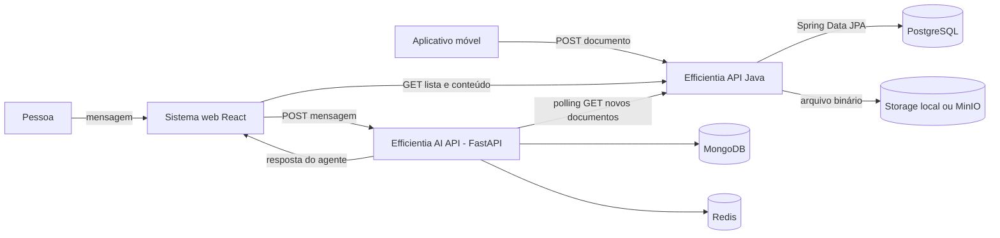
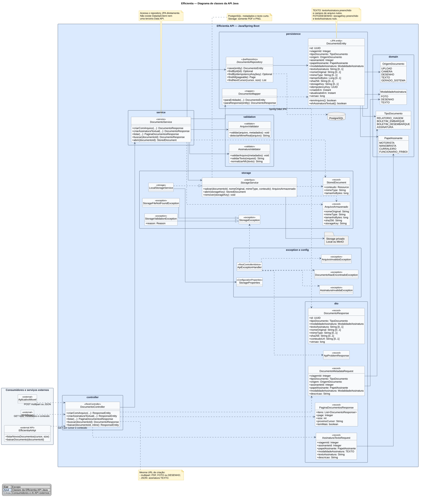
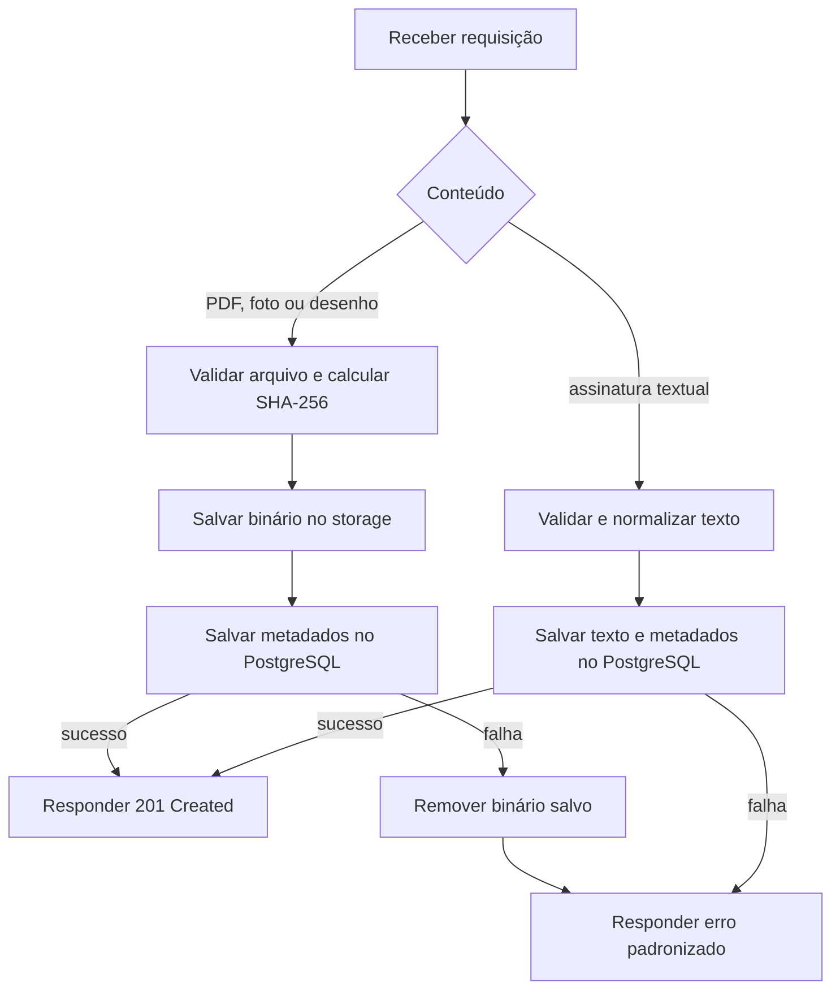

# Efficientia API — Especificação da estrutura inicial

## 1. Objetivo

Este documento define a estrutura inicial da API do Efficientia que será
versionada no GitHub.

O foco é receber PDF, PNG e assinaturas textuais enviados pelo aplicativo
móvel, persistir seus dados e disponibilizá-los para o sistema web e para a API
de IA.

## Atualização arquitetural — 18/08/2026

Na fase atual, a **API REST Principal** é responsável pela conexão principal
com o PostgreSQL/SQL, pelas regras de negócio e pela integração de dados com o
aplicativo móvel e o sistema web React.

O MongoDB e o Redis pertencem exclusivamente à **Efficientia AI API**. A API
REST Principal não acessa MongoDB, não persiste memória conversacional e não
processa filas da IA.

A API de conexão com banco de dados permanece como uma etapa posterior da
arquitetura. Ela não participa do fluxo atual da API REST e não deve ser
introduzida como proxy genérico sem um contrato e uma responsabilidade próprios.

A divisão funcional planejada é:

1. **Efficientia API**, em Java e Spring Boot: documentos, regras de negócio,
   PostgreSQL e armazenamento dos arquivos;
2. **Efficientia AI API**, em Python com FastAPI: conversa com o usuário,
   agente, RAG, MongoDB e processamento assíncrono relacionado à IA;
3. **API de conexão com banco**, planejada para uma etapa posterior, com
   contrato interno próprio e sem responsabilidade sobre MongoDB da IA.

No escopo atual, a Efficientia API acessa o PostgreSQL diretamente com Spring
Data JPA. A criação ou ativação da terceira API será documentada em uma nova
decisão arquitetural antes de alterar esse fluxo.

---

## 2. Decisão de arquitetura

### 2.1 Arquitetura recomendada

```text
Aplicativo móvel ─┐
                  ├── HTTP ──> Efficientia API ──> PostgreSQL
Sistema web ──────┘                    │
                                      └──────────> Storage local ou MinIO

Sistema web ── HTTP ──> Efficientia AI API ──> agente e RAG
                              │
                              ├── HTTP ──> Efficientia API (documentos autorizados)
                              ├──────────> MongoDB (exclusivo da AI API)
                              └──────────> Redis (exclusivo da AI API)
```

Essa divisão mantém dois limites claros:

- a Efficientia API é dona dos documentos e dos respectivos metadados;
- a AI API é dona das conversas, da memória do agente e do índice de RAG.

### 2.2 API de conexão com banco como etapa posterior

No incremento atual, a API REST Principal mantém a conexão principal com o
PostgreSQL usando Spring Data JPA. Essa decisão permite implementar e validar o
contrato usado pelo Mobile e pelo React sem criar dependência adicional agora.

A API de conexão com banco poderá ser evoluída posteriormente, mas deverá ter
um contrato interno claro, autenticação entre serviços e uma responsabilidade
real. Ela não deve ser um proxy genérico do MongoDB e não deve deslocar a
persistência conversacional da AI API.

### 2.3 Assíncrono e NoSQL pertencem à AI API

O processamento assíncrono da IA é responsabilidade da AI API. Ela pode:

1. receber a requisição;
2. validar e persistir o estado inicial;
3. publicar um job no Redis;
4. responder `202 Accepted`;
5. concluir o processamento em um worker.

No primeiro incremento, o upload de PDF e PNG será síncrono e responderá `201
Created`. OCR, geração de ZIP e indexação de RAG são bons candidatos a jobs
assíncronos.

### 2.4 O mobile não acessa o banco diretamente

A frase “o documento vai direto para o banco” deve significar que existe apenas
uma API entre o aplicativo e a persistência. O aplicativo móvel **não** recebe
URL JDBC, usuário ou senha e nunca se conecta ao PostgreSQL ou MongoDB.

Fluxo correto:

```text
Mobile -> HTTP -> Efficientia API -> storage + PostgreSQL
React -> HTTP -> Efficientia API -> PostgreSQL
React -> HTTP -> Efficientia AI API -> MongoDB/Redis
```

Fluxo proibido:

```text
Mobile -> JDBC/PostgreSQL
Mobile -> MongoDB
Web -> JDBC/PostgreSQL
React -> MongoDB
Efficientia API -> MongoDB
```

---

## 3. Atendimento aos requisitos

### 3.1 Desenvolvimento de Sistemas do segundo ano

A Efficientia API usa:

- Java 17;
- Spring Boot;
- Spring MVC;
- Spring Data JPA;
- PostgreSQL;
- Bean Validation;
- tratamento centralizado de exceções;
- API REST com `GET`, `POST`, `PATCH` e `DELETE` ao completar o CRUD;
- testes de controller, service, repository e integração.

A primeira entrega deve priorizar o fluxo que já pode ser demonstrado de ponta
a ponta: upload, listagem, consulta e download.

### 3.2 Banco de Dados do segundo ano

A distribuição dos bancos fica assim:

| Tecnologia | Responsável | Uso |
| --- | --- | --- |
| PostgreSQL | Efficientia API | Metadados dos documentos, viagens, usuários e auditoria |
| MongoDB | Efficientia AI API (FastAPI) | Sessões, mensagens e memória conversacional |
| Redis | Efficientia AI API (FastAPI) | Fila de ingestão, jobs de RAG e estado temporário |
| Storage local/MinIO | Efficientia API | Conteúdo binário de PDF e PNG |

MongoDB não deve duplicar os metadados dos documentos apenas para cumprir um
requisito. Seu uso natural neste projeto é a interação conversacional e ele é
consumido exclusivamente pela AI API. A API REST Principal consulta seus dados
relacionais no PostgreSQL.

### 3.3 Engenharia de Software

A documentação e a implementação devem conter:

- requisitos funcionais identificados;
- diagrama de classes;
- diagramas de atividade para upload e ingestão RAG;
- contratos HTTP;
- separação entre controller, service, repository e storage;
- critérios de aceite verificáveis;
- Conventional Commits, Pull Request e CI;
- rastreabilidade entre requisitos e endpoints.

### 3.4 API de conexão com banco

A API de conexão com banco é uma etapa posterior do projeto. Ela não substitui
a AI API, não consome MongoDB em nome da REST e não deve duplicar as regras de
negócio da API REST Principal. Sua implementação só deve começar depois que o
contrato entre serviços estiver definido.

---

## 4. Sistemas participantes

| Sistema | Responsabilidade |
| --- | --- |
| Aplicativo móvel | Capturar assinatura ou documento e enviá-lo |
| Efficientia API | Validar, armazenar, persistir metadados, listar e entregar documentos |
| Sistema web React | Usar a Efficientia API para dados/documentos e a AI API para conversa |
| Efficientia AI API (Python/FastAPI) | Receber mensagens, acionar o agente e sincronizar documentos para RAG |
| API de conexão com banco | Etapa posterior; contrato interno ainda não participa do fluxo atual |
| PostgreSQL | Persistir metadados relacionais |
| Storage local/MinIO | Guardar PDF e PNG privados |
| MongoDB | Guardar histórico e memória conversacional |
| Redis | Enfileirar trabalhos assíncronos da IA |

---

## 5. Arquitetura



O diagrama de classes está disponível nos dois formatos:

- [fonte PlantUML](./diagrams/CLASS_DIAGRAM_EFFICIENTIA_API.puml);
- [imagem SVG](./diagrams/CLASS_DIAGRAM_EFFICIENTIA_API.svg).



---

## 6. Decisão sobre o armazenamento do arquivo

### 6.1 Recomendação

O PostgreSQL deve guardar os **metadados** e o texto curto de uma assinatura,
mas não o conteúdo completo de PDF ou PNG. O binário deve ficar em storage
privado.

| Local | Conteúdo |
| --- | --- |
| PostgreSQL | UUID, viagem, assinante, modalidade, texto da assinatura, MIME, tamanho, SHA-256, storage key e datas |
| Storage | Bytes de PDF ou PNG de foto/desenho |

O texto de uma assinatura é um dado de negócio pequeno e pesquisável, não um
arquivo. Por isso, ele é persistido diretamente no PostgreSQL e não gera
`storageKey`.

Motivos:

- evita crescimento e backup excessivos do banco relacional;
- evita carregar bytes grandes em consultas de listagem;
- simplifica streaming e download;
- permite migrar de diretório local para MinIO/S3 sem mudar o contrato HTTP;
- evita Base64 e cópias desnecessárias.

### 6.2 Desenvolvimento local

Na primeira entrega, `LocalStorageService` salva os arquivos em um diretório
privado configurável. O nome original é mantido apenas como metadado: o caminho
físico usa UUIDs internos e nunca recebe texto controlado pelo cliente.

```properties
app.document-storage.path=./data/documentos
app.document-storage.max-pdf-size=25MB
app.document-storage.max-png-size=10MB
```

Em um ambiente publicado, a implementação poderá ser trocada por
`MinioStorageService`, mantendo a interface `StorageService`.

### 6.3 Alternativa rejeitada para o primeiro incremento

Guardar o arquivo como `bytea` no PostgreSQL é tecnicamente possível para um
protótipo pequeno, mas não é a escolha recomendada. Se o professor exigir que o
binário esteja no banco, a alteração deve ser explícita no modelo e nos limites
de tamanho; não se deve misturar `bytea` e MinIO sem uma regra definida.

---

## 7. Convenções HTTP

- URL-base pública: `/api/v1`;
- JSON: `application/json`;
- upload: `multipart/form-data`;
- erros: `application/problem+json`;
- PDF: `application/pdf`;
- PNG: `image/png`;
- IDs: UUID;
- datas: ISO 8601 em UTC;
- arquivos nunca são retornados em Base64;
- `Idempotency-Key` deve ser aceito nos comandos que podem ser repetidos;
- cursores são opacos e não devem ser interpretados pelos clientes.

Quando Spring Security for incluído, usar:

```http
Authorization: Bearer <token>
```

JWT não é obrigatório para a primeira demonstração acadêmica, mas nenhuma
credencial real deve entrar no Git.

---

## 8. Tipos do domínio

### 8.1 Tipo de documento

```text
RELATORIO_VIAGEM
BOLETIM_EMBARQUE
BOLETIM_DESEMBARQUE
ASSINATURA
```

### 8.2 Origem do documento

```text
UPLOAD
CAMERA
DESENHO
TEXTO
GERADO_SISTEMA
```

### 8.3 Modalidade da assinatura

```text
FOTO
DESENHO
TEXTO
```

### 8.4 Papel do assinante

```text
MOTORISTA
MANOBRISTA
CURRALEIRO
FUNCIONARIO_FRIBOI
```

### 8.5 Regras de assinatura

Quando `tipoDocumento=ASSINATURA`:

- `assinanteId`, `papelAssinante` e `modalidadeAssinatura` são obrigatórios;
- `FOTO` recebe um PNG capturado pela câmera;
- `DESENHO` recebe um PNG gerado pela área de desenho do aplicativo;
- `TEXTO` recebe `textoAssinatura` em JSON e não recebe arquivo;
- foto e desenho não recebem `textoAssinatura`;
- texto deve ter entre 1 e 150 caracteres depois de remover espaços externos;
- o servidor preserva maiúsculas, minúsculas e acentos e normaliza Unicode em
  NFC;
- HTML, scripts e caracteres de controle não são aceitos;
- `conteudoUrl` é `null` para a modalidade `TEXTO`.

Na primeira entrega, a foto deve ser convertida para PNG pelo aplicativo. JPEG
ou HEIC só devem ser adicionados quando houver um contrato e validação de MIME
correspondentes.

### 8.6 Acessibilidade da assinatura textual

A modalidade `TEXTO` permite que o motorista digite seu nome ou assinatura sem
precisar desenhar com precisão na tela. O aplicativo deve oferecer botão grande,
rótulo visível, suporte a leitor de tela e confirmação antes do envio. O site
deve exibir o valor como texto, nunca como HTML e sem convertê-lo artificialmente
em uma imagem cursiva.

---

## 9. Endpoints

### 9.1 Primeira entrega

| Método | Endpoint | Responsabilidade | Sucesso |
| --- | --- | --- | --- |
| `POST` | `/api/v1/documentos` | Cadastrar PDF, PNG ou assinatura textual | `201` |
| `GET` | `/api/v1/documentos` | Listar documentos autorizados | `200` |
| `GET` | `/api/v1/documentos/{documentoId}` | Consultar metadados | `200` |
| `GET` | `/api/v1/documentos/{documentoId}/conteudo` | Visualizar ou baixar o arquivo | `200` |

### 9.2 Incremento de CRUD

| Método | Endpoint | Responsabilidade | Sucesso |
| --- | --- | --- | --- |
| `PATCH` | `/api/v1/documentos/{documentoId}` | Alterar descrição e dados permitidos | `200` |
| `DELETE` | `/api/v1/documentos/{documentoId}` | Excluir metadados e binário | `204` |

### 9.3 Processos assíncronos futuros

| Método | Endpoint | Responsabilidade | Sucesso |
| --- | --- | --- | --- |
| `POST` | `/api/v1/exportacoes` | Solicitar criação de ZIP | `202` |
| `GET` | `/api/v1/exportacoes/{exportacaoId}` | Consultar estado do ZIP | `200` |
| `GET` | `/api/v1/exportacoes/{exportacaoId}/conteudo` | Baixar ZIP concluído | `200` |

Não existe endpoint de contagem na primeira entrega.

---

## 10. `POST /api/v1/documentos`

### 10.1 Documento com arquivo

Relatórios, boletins, fotos e desenhos usam multipart:

```http
POST /api/v1/documentos HTTP/1.1
Content-Type: multipart/form-data; boundary=...
Idempotency-Key: 4937c0e3-6dd4-488c-9f54-e1d97da57144
```

| Parte | Content-Type | Obrigatória | Conteúdo |
| --- | --- | --- | --- |
| `metadados` | `application/json` | Sim | Dados tipados do documento |
| `arquivo` | `application/pdf` ou `image/png` | Sim | Conteúdo binário |

Exemplo de relatório:

```json
{
  "viagemId": 1,
  "tipoDocumento": "RELATORIO_VIAGEM",
  "origem": "GERADO_SISTEMA",
  "assinanteId": null,
  "papelAssinante": null,
  "modalidadeAssinatura": null,
  "descricao": "Relatório final da viagem"
}
```

Exemplo de assinatura desenhada:

```json
{
  "viagemId": 1,
  "tipoDocumento": "ASSINATURA",
  "origem": "DESENHO",
  "assinanteId": 2,
  "papelAssinante": "MOTORISTA",
  "modalidadeAssinatura": "DESENHO",
  "descricao": "Assinatura no desembarque"
}
```

### 10.2 Assinatura textual

A mesma URL aceita JSON quando a modalidade é `TEXTO`. Não se envia multipart
nem uma parte `arquivo`:

```http
POST /api/v1/documentos HTTP/1.1
Content-Type: application/json
Idempotency-Key: bf733845-2f29-40ae-b9bc-5af5a1512d2f
```

```json
{
  "viagemId": 1,
  "tipoDocumento": "ASSINATURA",
  "origem": "TEXTO",
  "assinanteId": 2,
  "papelAssinante": "MOTORISTA",
  "modalidadeAssinatura": "TEXTO",
  "textoAssinatura": "João da Silva",
  "descricao": "Nome informado como assinatura no desembarque"
}
```

### 10.3 Validações

Para conteúdo com arquivo, a API valida:

- arquivo não vazio;
- tamanho máximo de 10 MiB para PNG;
- tamanho máximo de 25 MiB para PDF;
- MIME real pelos magic bytes, não apenas extensão ou header;
- extensão compatível com o MIME;
- nome original sanitizado;
- SHA-256 calculado no servidor.

Para assinatura textual, a API valida:

- `tipoDocumento=ASSINATURA`;
- `origem=TEXTO`;
- `modalidadeAssinatura=TEXTO`;
- `textoAssinatura` entre 1 e 150 caracteres;
- ausência de arquivo, HTML e caracteres de controle.

Nos dois formatos, `viagemId`, regras condicionais e `Idempotency-Key` são
validados. A repetição da mesma chave retorna o mesmo resultado.

### 10.4 Fluxo de persistência



Storage e PostgreSQL não participam da mesma transação ACID. Por isso, uma
falha ao salvar metadados de um conteúdo binário deve executar uma compensação
e remover o arquivo já criado. Assinatura textual usa somente a transação JPA.

### 10.5 Resposta `201 Created`

```http
HTTP/1.1 201 Created
Location: /api/v1/documentos/0d5118fc-5814-4459-8b47-996e1d3e73f7
Content-Type: application/json
```

```json
{
  "id": "0d5118fc-5814-4459-8b47-996e1d3e73f7",
  "viagemId": 1,
  "tipoDocumento": "RELATORIO_VIAGEM",
  "origem": "GERADO_SISTEMA",
  "nomeOriginal": "diario-viagem-2026-05-20.pdf",
  "mimeType": "application/pdf",
  "tamanhoBytes": 384210,
  "sha256": "43a2ad66da3d64c17b99cd5c233b56f35bc958809ed817156a648e7005050f056",
  "criadoEm": "2026-07-30T14:20:00Z",
  "atualizadoEm": "2026-07-30T14:20:00Z",
  "versao": 0,
  "conteudoUrl": "/api/v1/documentos/0d5118fc-5814-4459-8b47-996e1d3e73f7/conteudo"
}
```

Resposta de uma assinatura textual:

```json
{
  "id": "f889f18b-35b4-4d83-992d-0b2761c9c640",
  "viagemId": 1,
  "tipoDocumento": "ASSINATURA",
  "origem": "TEXTO",
  "modalidadeAssinatura": "TEXTO",
  "papelAssinante": "MOTORISTA",
  "textoAssinatura": "João da Silva",
  "nomeOriginal": null,
  "mimeType": null,
  "tamanhoBytes": null,
  "sha256": null,
  "conteudoUrl": null,
  "criadoEm": "2026-07-30T14:25:00Z",
  "atualizadoEm": "2026-07-30T14:25:00Z",
  "versao": 0
}
```

---

## 11. `GET /api/v1/documentos`

### 11.1 Uso pelo sistema web

O web usa paginação por página:

```http
GET /api/v1/documentos?page=0&size=20&sort=criadoEm,desc
```

Filtros permitidos:

| Campo | Tipo | Regra |
| --- | --- | --- |
| `viagemId` | integer | Opcional |
| `assinanteId` | integer | Opcional |
| `tipoDocumento` | enum | Opcional |
| `origem` | enum | Opcional |
| `modalidadeAssinatura` | enum | Opcional; somente assinaturas |
| `criadoDe` | date-time | Opcional |
| `criadoAte` | date-time | Opcional |
| `page` | integer | Mínimo zero |
| `size` | integer | Entre 1 e 100 |
| `sort` | string | Campos permitidos pelo servidor |

### 11.2 Uso pela AI API

O scheduler da AI API usa paginação por cursor:

```http
GET /api/v1/documentos?cursor=INICIO&size=100
```

Nas próximas chamadas, usa o `proximoCursor` da resposta anterior:

```http
GET /api/v1/documentos?cursor={cursorOpaco}&size=100
```

Regras:

- `INICIO` é o único valor conhecido pelo cliente;
- os demais cursores são opacos;
- a ordenação interna é determinística por `criadoEm` e `id`;
- não misturar `page` e `cursor`;
- o cursor é confirmado pela AI API apenas após registrar o lote;
- arquivos são deduplicados por `documentoId + sha256`;
- assinaturas textuais são deduplicadas por `documentoId + versao`;
- assinaturas não são indexadas no RAG por padrão, pois contêm dados pessoais.

### 11.3 Resposta

```json
{
  "itens": [
    {
      "id": "0d5118fc-5814-4459-8b47-996e1d3e73f7",
      "viagemId": 1,
      "tipoDocumento": "RELATORIO_VIAGEM",
      "modalidadeAssinatura": null,
      "textoAssinatura": null,
      "nomeOriginal": "diario-viagem-2026-05-20.pdf",
      "mimeType": "application/pdf",
      "tamanhoBytes": 384210,
      "sha256": "43a2ad66da3d64c17b99cd5c233b56f35bc958809ed817156a648e7005050f056",
      "criadoEm": "2026-07-30T14:20:00Z",
      "conteudoUrl": "/api/v1/documentos/0d5118fc-5814-4459-8b47-996e1d3e73f7/conteudo"
    }
  ],
  "page": 0,
  "size": 20,
  "totalElementos": 1,
  "totalPaginas": 1,
  "proximoCursor": null,
  "temMais": false
}
```

No modo cursor, `page`, `totalElementos` e `totalPaginas` podem ser `null` para
evitar uma consulta de contagem desnecessária.

---

## 12. Consulta e download individual

### 12.1 Metadados

```http
GET /api/v1/documentos/{documentoId}
```

Retorna `DocumentoResponse` sem ler o binário. Para assinatura textual, o
campo `textoAssinatura` é preenchido e `conteudoUrl` é `null`.

### 12.2 Conteúdo

```http
GET /api/v1/documentos/{documentoId}/conteudo?inline=true
```

Para visualização:

```http
Content-Type: application/pdf
Content-Disposition: inline; filename*=UTF-8''relatorio.pdf
Cache-Control: private, no-store
```

Para download, `inline` é falso por padrão e o servidor usa:

```http
Content-Disposition: attachment; filename*=UTF-8''relatorio.pdf
```

O conteúdo deve ser transmitido como stream. O controller não deve carregar o
arquivo inteiro em um `byte[]`.

Se o recurso for uma assinatura textual, não existe binário. Uma chamada ao
endpoint de conteúdo retorna `409 Conflict` com o código
`ASSINATURA_TEXTUAL_SEM_ARQUIVO`; o site deve usar `textoAssinatura` recebido
nos metadados.

---

## 13. Modelo relacional mínimo

### 13.1 Tabela `documento`

```text
id                       UUID PK
viagem_id                INTEGER FK, not null
tipo_documento           VARCHAR com CHECK, not null
origem                   VARCHAR com CHECK, not null
assinante_id             INTEGER FK, nullable
papel_assinante          VARCHAR com CHECK, nullable
modalidade_assinatura    VARCHAR com CHECK, nullable
texto_assinatura         VARCHAR(150), nullable
descricao                VARCHAR(300), nullable
nome_original            VARCHAR(255), nullable
mime_type                VARCHAR com CHECK, nullable
tamanho_bytes            BIGINT, nullable
sha256                   CHAR(64), nullable
storage_key              VARCHAR(500), unique, nullable
idempotency_key          UUID, unique, not null
criado_por               INTEGER FK, nullable
criado_em                TIMESTAMPTZ, not null
atualizado_em            TIMESTAMPTZ, not null
versao                   BIGINT, not null
```

Os campos `viagem_id`, `assinante_id` e `criado_por` usam `INTEGER` para
referenciar as chaves `SERIAL` já existentes em `relatorio_viagem` e `usuario`.
Somente o identificador público do documento e a chave de idempotência usam
UUID.

Uma constraint deve garantir a exclusividade:

- assinatura `TEXTO`: `texto_assinatura` preenchido e campos de arquivo nulos;
- demais conteúdos: `texto_assinatura` nulo e campos de arquivo preenchidos.

Índices recomendados:

- `(viagem_id, criado_em desc)`;
- `(assinante_id, criado_em desc)`;
- `(criado_em, id)` para paginação por cursor;
- `sha256` para diagnóstico e deduplicação;
- `idempotency_key` único.

### 13.2 Auditoria

Criação, alteração, download e exclusão são operações auditáveis. O banco pode
usar triggers para registrar `OLD`, `NEW`, operação, usuário e data nas
operações de alteração e exclusão.

---

## 14. Estrutura recomendada da Efficientia API

```text
efficientia/
├── docs/
│   ├── diagrams/
│   │   ├── CLASS_DIAGRAM_EFFICIENTIA_API.puml
│   │   └── CLASS_DIAGRAM_EFFICIENTIA_API.svg
│   └── SPEC_INITIAL-STRUCTURE.md
├── src/
│   ├── main/
│   │   ├── java/com/example/efficientia/
│   │   │   ├── EfficientiaApplication.java
│   │   │   ├── config/
│   │   │   │   ├── OpenApiConfig.java
│   │   │   │   └── StorageProperties.java
│   │   │   ├── controller/
│   │   │   │   └── DocumentoController.java
│   │   │   ├── domain/
│   │   │   │   ├── ModalidadeAssinatura.java
│   │   │   │   ├── OrigemDocumento.java
│   │   │   │   ├── PapelAssinante.java
│   │   │   │   └── TipoDocumento.java
│   │   │   ├── dto/
│   │   │   │   ├── ApiProblemResponse.java
│   │   │   │   ├── AssinaturaTextoRequest.java
│   │   │   │   ├── DocumentoMetadataRequest.java
│   │   │   │   ├── DocumentoPatchRequest.java
│   │   │   │   ├── DocumentoResponse.java
│   │   │   │   ├── FieldErrorResponse.java
│   │   │   │   └── PaginaDocumentosResponse.java
│   │   │   ├── exception/
│   │   │   │   ├── ApiExceptionHandler.java
│   │   │   │   ├── ArquivoInvalidoException.java
│   │   │   │   ├── DocumentoNaoEncontradoException.java
│   │   │   │   └── StorageException.java
│   │   │   ├── mapper/
│   │   │   │   └── DocumentoMapper.java
│   │   │   ├── persistence/
│   │   │   │   ├── DocumentoEntity.java
│   │   │   │   └── DocumentoRepository.java
│   │   │   ├── service/
│   │   │   │   └── DocumentoService.java
│   │   │   ├── storage/
│   │   │   │   ├── ArquivoArmazenado.java
│   │   │   │   ├── LocalStorageService.java
│   │   │   │   ├── StorageException.java
│   │   │   │   ├── StorageFileNotFoundException.java
│   │   │   │   ├── StorageService.java
│   │   │   │   ├── StorageValidationException.java
│   │   │   │   └── StoredDocument.java
│   │   │   └── validation/
│   │   │       ├── ArquivoValidator.java
│   │   │       └── AssinaturaValidator.java
│   │   └── resources/
│   │       ├── application.properties
│   │       └── db/migration/V1__create_documento.sql
│   └── test/java/com/example/efficientia/
│       ├── controller/DocumentoControllerTest.java
│       ├── persistence/DocumentoRepositoryTest.java
│       ├── service/DocumentoServiceTest.java
│       └── storage/LocalStorageServiceTest.java
├── .gitignore
├── mvnw
├── mvnw.cmd
└── pom.xml
```

No escopo atual, a Efficientia API não possui `DataApiClient` nem DTOs internos
de uma API de conexão. A eventual API de conexão com banco será uma aplicação
separada, com contrato próprio, e não poderá ser um proxy genérico ou deslocar
o acesso ao MongoDB da AI API.

---

## 15. Responsabilidade das classes

### 15.1 Controller

`DocumentoController` deve:

- declarar rotas, status e content types;
- receber multipart para arquivos e JSON para assinatura textual;
- aplicar `@Valid`;
- delegar ao service;
- montar headers HTTP.

Não deve acessar repository, banco ou sistema de arquivos diretamente.

Assinatura proposta:

```java
@RestController
@RequestMapping("/api/v1/documentos")
public class DocumentoController {

    @PostMapping(consumes = MediaType.MULTIPART_FORM_DATA_VALUE)
    public ResponseEntity<DocumentoResponse> criarComArquivo(
            @Valid @RequestPart("metadados") DocumentoMetadataRequest metadados,
            @RequestPart("arquivo") MultipartFile arquivo,
            @RequestHeader("Idempotency-Key") UUID idempotencyKey) {
        return documentoService.criarComArquivo(metadados, arquivo, idempotencyKey);
    }

    @PostMapping(consumes = MediaType.APPLICATION_JSON_VALUE)
    public ResponseEntity<DocumentoResponse> criarAssinaturaTextual(
            @Valid @RequestBody AssinaturaTextoRequest request,
            @RequestHeader("Idempotency-Key") UUID idempotencyKey) {
        return documentoService.criarAssinaturaTextual(request, idempotencyKey);
    }

    @GetMapping
    public PaginaDocumentosResponse listar(
            @RequestParam(required = false) Integer page,
            @RequestParam(required = false) String cursor,
            @RequestParam(defaultValue = "20") int size) {
        return documentoService.listar(page, cursor, size);
    }
}
```

### 15.2 Service

`DocumentoService` orquestra:

- validação de arquivo ou texto, conforme a modalidade;
- normalização Unicode NFC sem mudar a capitalização digitada;
- hash e nome seguro quando existe arquivo;
- gravação do conteúdo binário no storage;
- transação JPA dos metadados e do texto curto;
- compensação do storage em caso de falha JPA;
- mapeamento da entidade para response;
- autorização de listagem e download.

### 15.3 Repository e entidade

`DocumentoRepository` é um `JpaRepository<DocumentoEntity, UUID>` e pertence à
própria Efficientia API.

`DocumentoEntity` mapeia metadados e, quando aplicável, o texto curto da
assinatura. Ela nunca possui Base64 nem `byte[] conteudo`.

### 15.4 Storage

`StorageService` abstrai onde o arquivo está guardado:

```java
public interface StorageService {
    ArquivoArmazenado salvar(
            UUID documentoId,
            String nomeOriginal,
            String mimeType,
            InputStream conteudo
    );
    StoredDocument abrir(String storageKey);
    void remover(String storageKey);
}
```

`LocalStorageService` é a primeira implementação. Uma implementação MinIO pode
ser adicionada sem alterar controller, DTO ou repository. O método `salvar`
consome o conteúdo em streaming e calcula tamanho e SHA-256 na mesma passagem;
o hash não é aceito como dado confiável vindo do cliente.

### 15.5 Validador

`ArquivoValidator` valida MIME real, extensão, tamanho e nome.
`AssinaturaValidator` ou Bean Validation garante a exclusividade entre arquivo
e texto e as regras de cada modalidade.

### 15.6 Mapper

`DocumentoMapper` converte request, entidade e response. O mapper impede que
`storageKey` e caminhos internos sejam expostos ao mobile ou ao web.

---

## 16. Configuração e dependências

### 16.1 Dependências Maven principais

- `spring-boot-starter-web`;
- `spring-boot-starter-validation`;
- `spring-boot-starter-data-jpa`;
- `postgresql` em runtime;
- `flyway-core`;
- Apache Tika ou biblioteca equivalente para detectar MIME;
- `springdoc-openapi-starter-webmvc-ui`;
- `spring-boot-starter-test`.

### 16.2 Variáveis de ambiente

```dotenv
SPRING_DATASOURCE_URL=jdbc:postgresql://localhost:5432/efficientia
SPRING_DATASOURCE_USERNAME=efficientia
SPRING_DATASOURCE_PASSWORD=trocar-localmente
DOCUMENT_STORAGE_PATH=./data/documentos
MAX_PDF_SIZE=25MB
MAX_PNG_SIZE=10MB
```

Credenciais devem ser fornecidas por ambiente e nunca commitadas.

---

## 17. Efficientia AI API

### 17.1 Tecnologia e execução

A Efficientia AI API será implementada em **Python com FastAPI**, executada
sobre ASGI. Essa é uma decisão definitiva do projeto, não apenas uma
preferência de implementação.

A organização deve manter limites equivalentes aos da API Java:

- modelos de entrada, saída e configuração validados com Pydantic;
- rotas HTTP concentradas em `app.api.routes`;
- orquestração do agente e regras de aplicação em `app.services`;
- acesso ao MongoDB, Redis e à Efficientia API por adaptadores próprios;
- funções `async` somente em fluxos que usam clientes de I/O não bloqueantes;
- contrato OpenAPI publicado em `/openapi.json` e documentação local em
  `/docs`;
- exceções convertidas por handlers do FastAPI para
  `application/problem+json`.

FastAPI não altera os limites de domínio: a AI API continua sem acesso direto
ao PostgreSQL, ao storage ou aos diretórios internos da Efficientia API.

### 17.2 Fluxo de conversa

```text
Pessoa
-> Sistema web React
-> POST /api/v1/mensagens na AI API
-> AgentOrchestrator
-> agente
-> AI API
-> sistema web
-> pessoa
```

A rota de mensagens não pertence à Efficientia API Java.

### 17.3 Sincronização periódica de documentos

```text
DocumentSyncScheduler
-> GET Efficientia API /api/v1/documentos?cursor=INICIO&size=100
-> para cada item novo: GET /api/v1/documentos/{id}/conteudo
-> publicar trabalho de ingestão no Redis
-> extrair texto e indexar RAG
-> deduplicar por documentoId + sha256
-> confirmar proximoCursor
```

A AI API não acessa PostgreSQL, storage ou diretórios internos da Efficientia
API. Ela usa somente o contrato HTTP público.

### 17.4 MongoDB

MongoDB guarda documentos como:

```json
{
  "sessaoId": "730c4ed9-c596-4d90-9b24-5880784d05c1",
  "usuarioId": "35b415a8-6fd8-4530-baea-4a011bc0282d",
  "mensagens": [
    {
      "papel": "USER",
      "conteudo": "Resuma os problemas da viagem.",
      "criadoEm": "2026-07-30T14:20:00Z"
    }
  ],
  "memoria": {},
  "atualizadoEm": "2026-07-30T14:20:00Z"
}
```

### 17.5 Redis

Redis pode guardar:

- fila de documentos aguardando extração;
- retry de ingestão;
- lock do scheduler;
- estado temporário de jobs;
- ranking temporário, se houver requisito de negócio real.

Dados de longo prazo e histórico de conversa não devem depender apenas do
Redis.

---

## 18. Tratamento padronizado de erro

Na Efficientia API Java, usar `@RestControllerAdvice`. Na Efficientia AI API,
usar exception handlers do FastAPI. As duas APIs devem retornar
`application/problem+json` e preservar o mesmo formato de erro quando o campo
for aplicável.

Exemplo:

```json
{
  "type": "https://api.efficientia.local/problems/arquivo-invalido",
  "title": "Arquivo inválido",
  "status": 415,
  "detail": "Somente arquivos PDF e PNG são aceitos.",
  "instance": "/api/v1/documentos",
  "codigo": "ARQUIVO_TIPO_NAO_SUPORTADO",
  "timestamp": "2026-07-30T14:30:00Z",
  "correlationId": "4fc7d651-daad-4bb0-ae49-3b09440df766",
  "erros": []
}
```

| Status | Uso |
| --- | --- |
| `400` | Requisição ou combinação de filtros inválida |
| `401` | Não autenticado, quando a segurança estiver ativa |
| `403` | Documento fora da autorização do usuário |
| `404` | Documento não encontrado |
| `409` | Conflito de versão ou idempotência |
| `413` | Arquivo acima do limite |
| `415` | MIME diferente de PDF ou PNG |
| `422` | Regra de negócio inválida |
| `500` | Falha interna não prevista |
| `503` | PostgreSQL ou storage temporariamente indisponível |

---

## 19. Segurança e privacidade

- validar autorização em listagem, consulta e download;
- manter o bucket e o diretório privados;
- nunca retornar `storageKey` ou caminho físico;
- nunca gerar URL pública permanente;
- não registrar bytes, assinatura, CPF ou token nos logs;
- sanitizar `Content-Disposition`;
- impedir path traversal;
- limitar multipart no Spring e no proxy;
- calcular SHA-256 no servidor;
- usar HTTPS fora do ambiente local;
- aplicar `Cache-Control: private, no-store` ao conteúdo;
- validar magic bytes antes de persistir;
- excluir ou anonimizar conforme política de retenção e LGPD.

---

## 20. Testes

### 20.1 Controller

`DocumentoControllerTest` deve proteger:

- rota e content type do multipart;
- rota JSON da assinatura textual;
- `201` no arquivo e no texto válidos;
- rejeição de texto vazio, HTML ou arquivo junto com modalidade `TEXTO`;
- `400`, `413` e `415` nos contratos inválidos;
- paginação por página e por cursor;
- assinatura textual sem `conteudoUrl`;
- headers de visualização e download;
- JSON padronizado de erro.

### 20.2 Service

`DocumentoServiceTest` deve proteger:

- hash calculado antes da persistência do arquivo;
- storage salvo antes dos metadados do arquivo;
- remoção compensatória quando o repository falha;
- assinatura textual não chama `StorageService`;
- texto preserva acentos, capitalização e normalização NFC;
- idempotência;
- mapper não expõe `storageKey`;
- documento inexistente gera `404`.

### 20.3 Repository

`DocumentoRepositoryTest`, com PostgreSQL de teste ou Testcontainers, deve
proteger:

- constraints;
- índices e ordenação por `criadoEm, id`;
- chave de idempotência única;
- paginação e filtros.

### 20.4 Storage

`LocalStorageServiceTest` deve proteger:

- salvar, abrir e remover arquivo;
- nome físico independente do nome original;
- bloqueio de path traversal;
- streaming sem carregar o arquivo inteiro.

Testes devem validar comportamento observável, não textos de placeholder.

---

## 21. Requisitos funcionais

| ID | Requisito funcional |
| --- | --- |
| `RF-DOC-01` | Cadastrar documento PDF ou PNG |
| `RF-DOC-02` | Vincular documento a uma viagem |
| `RF-DOC-03` | Registrar assinante e papel quando aplicável |
| `RF-DOC-04` | Registrar assinatura como foto, desenho ou texto |
| `RF-DOC-05` | Listar documentos com paginação e filtros |
| `RF-DOC-06` | Consultar metadados e assinatura textual |
| `RF-DOC-07` | Visualizar ou baixar um documento autorizado |
| `RF-DOC-08` | Alterar os metadados permitidos |
| `RF-DOC-09` | Excluir documento, texto ou arquivo |
| `RF-DOC-10` | Permitir ingestão incremental pela AI API |
| `RF-DOC-11` | Auditar operações críticas |
| `RF-IA-01` | Receber mensagens do sistema web |
| `RF-IA-02` | Manter memória conversacional no MongoDB |
| `RF-IA-03` | Enfileirar e processar ingestão no Redis |
| `RF-IA-04` | Indicar documentos usados como fonte da resposta |

### 21.1 Rastreabilidade

| Requisito | Endpoint ou classe principal |
| --- | --- |
| `RF-DOC-01` a `RF-DOC-04` | `POST /api/v1/documentos`, `DocumentoService` |
| `RF-DOC-05` | `GET /api/v1/documentos`, `DocumentoRepository` |
| `RF-DOC-06` | `GET /api/v1/documentos/{id}` |
| `RF-DOC-07` | `GET /api/v1/documentos/{id}/conteudo`, `StorageService` |
| `RF-DOC-08` | `PATCH /api/v1/documentos/{id}` |
| `RF-DOC-09` | `DELETE /api/v1/documentos/{id}` |
| `RF-DOC-10` | cursor da listagem e `DocumentSyncScheduler` da AI API |
| `RF-DOC-11` | auditoria e logs estruturados |
| `RF-IA-01` | `POST /api/v1/mensagens`, `app.api.routes.messages` |
| `RF-IA-02` | `app.repositories.conversations` |
| `RF-IA-03` | `app.queues.ingestion` |
| `RF-IA-04` | `app.services.rag_indexer` e resposta do agente |

---

## 22. Critérios de aceite da primeira entrega

1. o projeto compila com Java 17;
2. `POST /api/v1/documentos` aceita multipart com JSON e PDF ou PNG;
3. a mesma URL aceita JSON para uma assinatura textual;
4. foto, desenho e texto seguem regras mutuamente exclusivas;
5. o texto preserva nome, acentos e capitalização e não aceita HTML;
6. arquivo vazio, acima do limite ou com MIME falso é rejeitado;
7. o binário é salvo fora do PostgreSQL;
8. a assinatura textual é salva no PostgreSQL sem arquivo ou `storageKey`;
9. os dados são salvos pela Efficientia API com Spring Data JPA;
10. uma falha de JPA depois do storage remove o arquivo órfão;
11. `GET /api/v1/documentos` não retorna Base64 ou `storageKey`;
12. a listagem retorna o texto e `conteudoUrl=null` na modalidade `TEXTO`;
13. `GET /api/v1/documentos/{id}/conteudo` transmite somente binários;
14. o cursor retorna itens em ordem determinística;
15. controllers não acessam repository ou storage diretamente;
16. no escopo atual, não existe `DataApiClient` nem uma Data API pass-through; a API de conexão futura terá contrato próprio;
17. erros seguem `application/problem+json`;
18. nenhum segredo, documento ou assinatura real entra no commit;
19. o diagrama de classes corresponde à estrutura de pacotes;
20. a AI API acessa documentos por HTTP, não pelo PostgreSQL ou storage;
21. assinaturas ficam fora do RAG por padrão;
22. MongoDB e Redis ficam associados ao fluxo conversacional e de IA.

---

## 23. Sequência recomendada de implementação

### Incremento 1 — API Java funcional

1. corrigir o pacote `Controller` para `controller`;
2. remover o controller de teste atual;
3. configurar JPA, PostgreSQL e Flyway;
4. criar entidade, repository e migration de `documento`;
5. criar DTOs e validações de arquivo e assinatura textual;
6. criar `StorageService` e `LocalStorageService`;
7. implementar upload com compensação;
8. implementar assinatura textual sem chamada ao storage;
9. implementar listagem, metadados e download;
10. adicionar tratamento de erro e OpenAPI;
11. cobrir arquivo e texto com testes e smoke test.

### Incremento 2 — CRUD e segurança

1. implementar `PATCH` com `@Version`;
2. implementar `DELETE` com remoção do binário;
3. adicionar auditoria;
4. adicionar autenticação e autorização;
5. publicar storage MinIO se necessário.

### Incremento 3 — exportação ZIP da API principal

1. criar entidade e migration de `exportacao`;
2. expor solicitação assíncrona e consulta de estado;
3. validar autorização, limites e idempotência antes de enfileirar;
4. gerar e guardar o ZIP por streaming em worker;
5. expor download privado, expiração e limpeza;
6. cobrir estados, falha, download e expiração com testes.

O ZIP integra o escopo da EFFICIENTI-94. Retirá-lo da release exige alteração
explícita do escopo e dos critérios de aceite no Jira.

### Incremento 4 — AI API em Python/FastAPI

1. criar o projeto Python/FastAPI com configuração Pydantic, health check e
   OpenAPI;
2. definir schemas e criar `POST /api/v1/mensagens`;
3. persistir sessão e memória no MongoDB;
4. criar o cliente HTTP e o scheduler de documentos;
5. publicar e consumir jobs no Redis;
6. extrair conteúdo e indexar RAG;
7. citar as fontes usadas na resposta;
8. adicionar observabilidade de latência, erros e custo.

---

## 24. Decisão registrada

**Decisão:** manter duas APIs: Efficientia API em Java/Spring Boot e
Efficientia AI API em Python/FastAPI.

**Removido:** Efficientia Data API pass-through.

**Consequências positivas:**

- menos chamadas HTTP;
- menos DTOs duplicados;
- Spring Data JPA demonstrado diretamente no projeto Java;
- upload e consulta mais simples;
- menos serviços para executar e depurar;
- separação preservada onde existe diferença real de domínio e tecnologia.
- contrato OpenAPI nativo e validação de schemas com Pydantic na AI API;
- suporte direto a I/O assíncrono para agente, MongoDB, Redis e chamadas HTTP.

**Consequências aceitas:**

- a Efficientia API conhece PostgreSQL e storage;
- a AI API conhece MongoDB e Redis;
- cada API deve proteger suas próprias credenciais;
- a AI API possui ciclo de build e implantação Python separado da API Java;
- separar dados em outro serviço no futuro exigirá uma migração explícita, não
  uma abstração antecipada.
